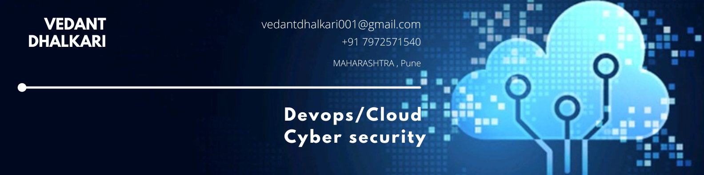

<!-- Hero text -->
<h1 align="center">Hey 👋, <a href="linkedin.com/in/vedant-dhalkari">I'm Vedant_Dhalkari 👨‍💻</a></h1>
<!-- Snake Game -->
<picture align="center">
  <source media="(prefers-color-scheme: dark)" srcset="https://raw.githubusercontent.com/Abhiz2411/Abhiz2411/output/github-snake-dark.svg" />
  <source media="(prefers-color-scheme: light)" srcset="https://raw.githubusercontent.com/Abhiz2411/Abhiz2411/output/github-snake.svg" />
  
</picture>

<!-- Typing text -->

  

<picture> </picture>

<h3 align="justify">
💻 A passionate Cybersecurity & Cloud Enthusiast with expertise in DevSecOps, Cloud Security, and Network Administration.  
🚀 Constantly learning, exploring, and securing the digital world.  
</h3>

---

## <picture></picture> About me
- 🔐 DevSecOps Lead @ **HICA**  
- 🕵️ Bug Bounty & Security Researcher  
- 🌱 Interned @ **Hacktify Cyber Security**  
- ☁️ Skilled in **Azure, AWS, Google Cloud, Docker, Kubernetes, RedHat Linux**  
- 📫 Connect with me on [LinkedIn](https://linkedin.com/in/vedant-dhalkari)  

---

### 🏆 Work Experience & Certifications
- **HICA** – DevSecOps Lead  
- **Hacktify Cyber Security** – Internship  
- **KasNet Technologies Pvt. Ltd** – Microsoft AZ-900 Internship  
- **MIT WPU** – Coursework in Cloud & Security  

**Certifications:**
- 🟦 Microsoft Certified: Azure Fundamentals (AZ-900)  
- 🐧 Red Hat Linux (RHEL)  
- 🔐 OWASP® Top 10 Security Threats (Linux Foundation)  
- 🌐 Cisco Certified: Cybersecurity Essentials & Networking (CCNA)  
- ☁️ Google Cloud Security & Operations, Infrastructure & Modernization  
- 🐳 IBM Containers & Kubernetes Essentials, Docker Essentials  
- 🚀 AWS Fundamentals of DevOps on Cloud  
- 🛡️ Defend against Threats with Microsoft 365  
- 📦 Practical GitHub Actions  

---

### 🛠️ Tech Stack & Skills

 
 
 

# 💻 Tech Stack:

### ☁️ Cloud & Infrastructure

  
  
  
  
  
  

### 🐳 DevOps, Security & Containers

  
  
  
  
  
  
  
  
  

### 💻 Languages & Scripting

  
  
  
  
  
  
  
  
  

### 🛠️ Frameworks & Web

  
  
  
  
  
  
  
  

### 🗄️ Databases

  
  
  
  
  
  

### ⚙️ Tools, Workflow & Design

  
  
  
  
  
  
  

---

---

## <b> Let's Connect..!</b> 
 
<!--icons and links-->

 

  

